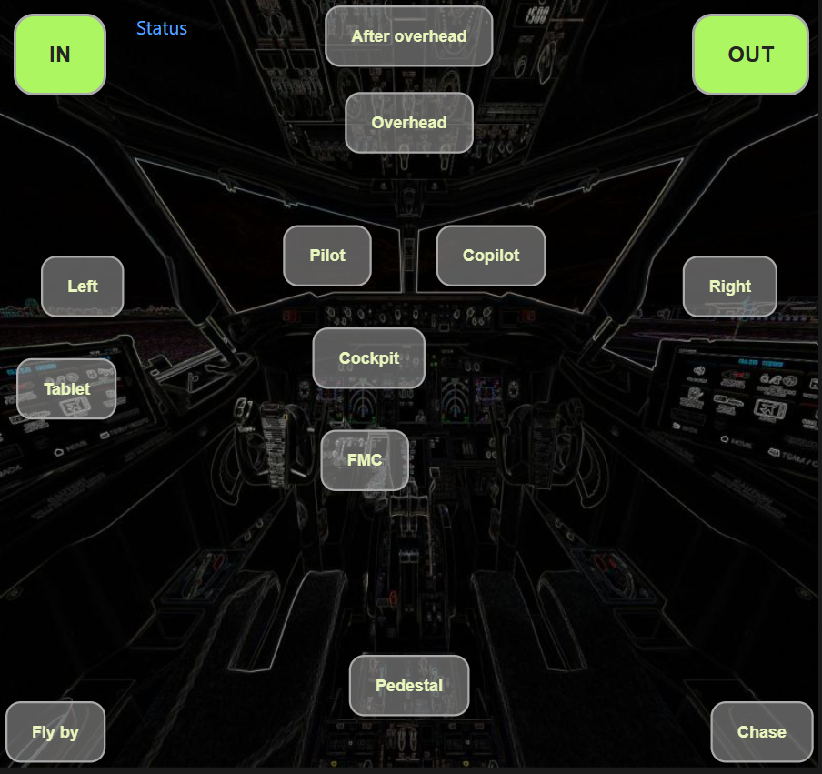

# xplapi

An X-Plane 12 plugin that exposes a **REST HTTP API** for reading (and eventually writing) datarefs and executing commands.  
Useful for driving external displays, tablet panels, scripts, and home-cockpit tools without wrestling with UDP broadcast or SimConnect.

I know X-plane already has built-in web API and I tried to use it for some time. But I was not happy with that because
- it's quite difficult to use, you need to lookup object first, then use its id
- sometimes I was getting huge delays in response - tens of seconds or even over minute
- it can be called only from localhost (the PC with X-plane) so it's not usable e.g. for tablets on the same network - with some reverse proxy hacks

This plugin is addressing those issues - can work with datarefs names directly and can be called from other hosts in the network. It has also small built-in web server so you can directly host pages with web panels. Included example contains small page as views switcher for Zibo 737. But you can create web pages for anything - radio panels, autopilots, light panels or even some indicators (using web sockets).

Of course the API is not only for web pages, you can call it with curl or other projects.

So far it's built for Windows only (that's my setup), but feel free to create PR with Linux/Mac build tuning and I can add other platforms.

### Example - 737 views switcher



---

## Features

- **Zero configuration required** — starts on port `8012` out of the box
- **Lazy dataref resolution** — just ask for a name; the plugin finds the handle automatically
- **On-demand reads** — values are always fresh (updated every 100 ms by the flight loop)
- **Status page** at `/state` — live view of every tracked dataref in the browser
- **Static web server** — optional `www/` directory for custom pages (e.g. `api-test.html`, `ws-test.html`)
- **WebSocket streaming** — subscribe to dataref updates at a configurable interval
- **CORS enabled** — call the API directly from any browser tab or web app
- **Single config file** — optional `config.yaml` next to the `.xpl` file

---

## Installation

1. Download release binary or build the plugin (see [Building](#building)) from source.
2. Copy the output folder into X-Plane's plugin directory:

```
X-Plane 12/
  Resources/
    plugins/
      xplapi/
        64/
          win.xpl        ← the plugin
          config.yaml    ← optional, see Configuration
```

3. (Re)start X-Plane. Access status page at [http://localhost:8012](http://localhost:8012).

---

## Configuration

Place a `config.yaml` file in the same directory as `win.xpl`:

```yaml
# xplapi configuration
port: 8012    # HTTP port to listen on (default: 8012)
```

If the file is absent, all defaults apply. The plugin logs which port it starts on to the X-Plane developer console.

---

## Building

Prerequisites: **Visual Studio 2022** (MSVC v143, Windows 10 SDK).  
No CMake, no IDE needed — pure command-line MSBuild.

```bat
# Debug build
build

# Release build
build release

# Debug build + copy to X-Plane
build deploy

# Release build + copy to X-Plane
build release deploy

# Clean
build clean
```

The `deploy` step copies `win.xpl` to:
```
E:\XPL12\X-Plane 12\Resources\plugins\xplapi\64\
```
Adjust `DEPLOY_DIR` in `build.bat` if your X-Plane lives elsewhere.

---

## API Reference

Base URL: `http://localhost:8012`  
All API responses are `application/json`.

**Tip:** Open `http://localhost:8012/api-test.html` from the status page to try each endpoint from the browser — paste request bodies, click Execute, and see the status code and response.

---

### `GET /`

- If `www/index.html` exists: serves that file.
- Otherwise: redirects to `/state`.

### `GET /state`

Status page (HTML). Shows all currently tracked datarefs, their resolved types, and whether they were found in X-Plane. Lists detected HTML pages from the `www/` directory. Auto-refreshes every 5 seconds.

---

### Static web files (`www/`)

Place HTML files in the `www/` directory next to the plugin (e.g. `plugins/xplapi/www/`). They are served at `/filename.html` and linked from the status page.

| File | Description |
|------|--------------|
| `index.html` | Served at `/` when present; otherwise `/` redirects to `/state` |
| `api-test.html` | Interactive API test page — paste request bodies, execute each endpoint, view status code and response |
| `ws-test.html` | WebSocket test page — connect, paste dataref names, view live streaming updates |
| `737-views.html` | Zibo 737 cockpit/external view switcher — predefined views over cockpit/plane images. Copy `cockpit-m.jpg` from [fs-web-panels](https://github.com/me2d13/fs-web-panels) to `www/737-views/` for the inner view background. |
| `view-helper.html` | View tuning tool — WebSocket streams the 6 view datarefs, shows live values and copy-pasteable JSON for POST /api/dataref/write |

---

### `GET /api/dataref?name=<dataref-name>`

Read a single dataref by name.

**Query parameters**

| Parameter | Required | Description |
|-----------|----------|-------------|
| `name`    | yes      | Full X-Plane dataref path, URL-encoded |

**Response — resolved value**
```json
{
  "sim/time/total_running_time_sec": 1523.47
}
```

**Response — first request (not yet resolved) or dataref not found**
```json
{
  "sim/time/total_running_time_sec": null
}
```
Retry after ~100 ms if the dataref exists but is still resolving. The flight loop resolves the handle on the next tick.

**curl example**
```bash
curl "http://localhost:8012/api/dataref?name=sim/time/total_running_time_sec"
```

```bash
# URL-encode slashes are not required by most tools, but the name must be exact
curl "http://localhost:8012/api/dataref?name=sim/cockpit2/gauges/indicators/airspeed_kts_pilot"
```

---

### `POST /api/dataref/read`

Read one or more datarefs. Accepts a JSON array of names or a single name string.

**Request body — array**
```json
[
  "sim/time/total_running_time_sec",
  "sim/cockpit2/gauges/indicators/airspeed_kts_pilot",
  "sim/flightmodel/position/indicated_airspeed"
]
```

**Request body — single name**
```json
"sim/time/total_running_time_sec"
```

**Response** — object with dataref names as keys and values (or `null` for pending/not found):
```json
{
  "sim/time/total_running_time_sec": 1523.47,
  "sim/cockpit2/gauges/indicators/airspeed_kts_pilot": 142.3,
  "sim/flightmodel/position/indicated_airspeed": null
}
```

**curl example**
```bash
curl -X POST http://localhost:8012/api/dataref/read \
     -H "Content-Type: application/json" \
     -d '["sim/time/total_running_time_sec", "sim/cockpit2/gauges/indicators/airspeed_kts_pilot"]'
```

---

### `POST /api/dataref/write`

Write one or more datarefs. Request body is a JSON object with dataref names as keys and values.

**Request body**
```json
{
  "sim/graphics/view/pilots_head_psi": -45.0,
  "sim/graphics/view/pilots_head_the": -15.0
}
```

**Response** — same object with values after the write (or `null` for datarefs that could not be written):
```json
{
  "sim/graphics/view/pilots_head_psi": -45.0,
  "sim/graphics/view/pilots_head_the": -15.0
}
```

**PowerShell example**
```powershell
Invoke-RestMethod -Method Post -Uri "http://localhost:8012/api/dataref/write" -ContentType "application/json" -Body '{"sim/graphics/view/pilots_head_psi":-45.0, "sim/graphics/view/pilots_head_the":-15.0}'
```

---

## Typical usage pattern

On first contact the plugin needs one flight-loop tick (~100 ms) to resolve a new dataref name.  
A robust client should handle `null` values with a simple retry:

```python
import requests, time

BASE = "http://localhost:8012"

def read_dataref(name: str, retries: int = 5) -> dict:
    for _ in range(retries):
        r = requests.get(f"{BASE}/api/dataref", params={"name": name})
        data = r.json()
        if data.get(name) is not None:
            return data[name]
        time.sleep(0.15)
    return data.get(name)

print(read_dataref("sim/time/total_running_time_sec"))
# 1523.47
```

---

### `POST /api/command/once`
### `POST /api/command/begin`
### `POST /api/command/end`

Trigger an X-Plane command. `once` is for fire-and-forget commands (like a button click). `begin` and `end` are for commands that you want to hold down (like a starter motor or hydraulic pump).

**Request body**
```json
{
  "name": "sim/annunciator/test_all_annunciators"
}
```

**PowerShell example (Toggle pause)**
```powershell
Invoke-RestMethod -Method Post -Uri "http://localhost:8012/api/command/once" -ContentType "application/json" -Body '{"name":"sim/operation/pause_toggle"}'
```

**PowerShell example (Hold Brakes)**
```powershell
# Hold brakes
Invoke-RestMethod -Method Post -Uri "http://localhost:8012/api/command/begin" -ContentType "application/json" -Body '{"name":"sim/flight_controls/brakes_regular"}'

# Release brakes
Invoke-RestMethod -Method Post -Uri "http://localhost:8012/api/command/end" -ContentType "application/json" -Body '{"name":"sim/flight_controls/brakes_regular"}'
```

---

---

### WebSocket: `WS /api/dataref/watch`

Stream live dataref updates over WebSocket. Connect, send a JSON array of dataref names as the first message, then receive JSON snapshots at a configurable interval.

**URL:** `ws://localhost:8012/api/dataref/watch`

**Query parameters**

| Parameter      | Type | Default | Description |
|----------------|------|---------|-------------|
| `interval`     | int  | 1       | Update interval in seconds (1–60) |
| `alwaysUpdate` | bool | false   | Send every interval even when values unchanged |

**First client message (required):** JSON array of dataref names, or `{"names": ["...", "..."]}`

```json
["sim/time/total_running_time_sec", "sim/cockpit2/gauges/indicators/airspeed_kts_pilot"]
```

**Server messages:** JSON object `{datarefName: value, ...}` for each requested dataref

**Test page:** Open `http://localhost:8012/ws-test.html` to connect, paste datarefs, and view live updates.

*Inspired by [msfs-web-api](https://github.com/me2d13/msfs-web-api) for Microsoft Flight Simulator.*

## Project structure

```
xplapi/
├── SDK/                    X-Plane SDK (CHeaders + Libraries)
├── src/
│   ├── main.cpp            Plugin entry points + flight loop
│   ├── Config.cpp          config.yaml reader
│   ├── DataRefRegistry.cpp Lazy dataref lookup + value cache
│   ├── TcpListener.cpp     Winsock select()-based TCP server
│   ├── WebServer.cpp       HTTP routing + JSON responses
│   └── StaticFileServer.cpp Serves files from www/
├── www/                    Static web files (optional)
│   ├── index.html          Served at / if present
│   ├── api-test.html       Interactive API test page
│   ├── ws-test.html        WebSocket streaming test page
│   ├── view-helper.html    View tuning — live datarefs + JSON for setMultiple
│   └── *.html              Other pages (linked from status page)
├── include/
│   ├── plugin.h            Plugin identity + platform macros
│   ├── Config.h
│   ├── DataRefRegistry.h
│   ├── TcpListener.h
│   ├── WebServer.h
│   └── json.hpp            nlohmann/json (header-only)
├── build/                  Build output (gitignored)
├── xplapi.vcxproj          MSBuild project (x64 only)
├── build.bat               Command-line build script
└── README.md
```

---

## Thread-safety notes

X-Plane's dataref API (`XPLMFindDataRef`, `XPLMGetData*`) must be called from the **simulator's main thread**.  
The HTTP server runs on a separate thread.  
`DataRefRegistry` bridges the two with a mutex:

- **HTTP thread** calls `ensureTracked()` (inserts name) and `readValue()` (reads cached copy).  
- **Flight loop thread** calls `update()` every 100 ms — resolves any unresolved handles and refreshes all cached values — then releases the lock.

This means HTTP responses always return the value from the last flight-loop tick, with at most ~100 ms of staleness.

---

## License

MIT
